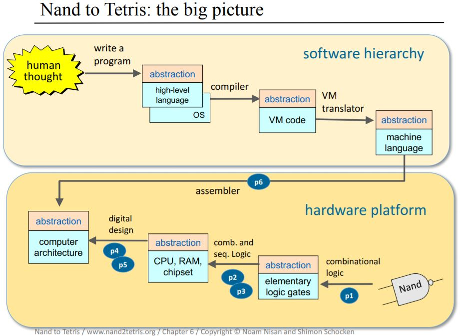

# From Nand to Tetris  

These are programming assignment submissions for a two-part Coursera course called From Nand to Tetris. The course steps through how to build a simple general-purpose computer, from hardware switching circuits to high-level object-based software design.

The course's objective is to integrate key ideas involving algorithms, computer architecture, operating systems, compilers and software engineering into a unified framework. An accompanying book is called The Elements of Computing Systems: Building a Modern Computer from First Principles. See reference links below. 

 

### Project 1: Boolean Functions and Logic Gates

A set of 15 elementary logic gates, designed from primative Nand gates and implemented with a simple Hardware Description Language (HDL). The chipset is later used to construct the computer's Arithmetic Logic Unit (ALU) and memory system.

### Project 2: Combinational Logic and the ALU

A family of binary adders - chips designed to add numbers, and a simple Arithmetic Logic Unit (ALU). The ALU performs arithmetic and logical operations and is the computer's calculating brain. The ALU is later used to build the computer's Central Processing Unit (CPU).

### Project 3: Sequential Logic and Memory

A hierarcy of memory chips, from elementary flip-flop gates, to one-bit registers, to n-bit registers, to a family of Random Access Memory (RAM) chips. Unlike processing chips, based on combinational logic, these require clock-based sequential logic.

### Project 4: Machine Language

Low-level assembly programs written with the Hack machine language.

### Project 5: Computer Architecture

An integration of previous chipsets into a general-purpose 16-bit computer called Hack, which can execute programs written in the Hack machine language. The computer includes a Central Processing Unit (CPU), which is integrated with the RAM.

### Project 6: Assembler

An assembler that translates a symbolic machine language, also known as assembly, into into binary 0s and 1s. The resultig binary code executes as-is on the Hack platform. Translation techniques include parsing, a symbol table, and macro-assembly. 

Here is the Python application, with unit tests: [Hack Assembler](https://github.com/ptdriscoll/hack-assembler)

### Project 7: Virtual Machine I - Stack Arithmetic

The first half of a virtual machine, which translates virtual machine language into Hack assembly. Focused on stack-based arithmetic and memory access operations, this begins the back end of a program compiler. Modern software architectures such as Java and .NET use such two-tier compilers.

### Project 8: Virtual Machine II - Program Control

An extension of the virtual machine translater, which adds flow control and subroutine call-and-return commands. This completes the virtual machine. 

Here is the full Python application for parts I and II, with unit tests: [Hack Virtual Machine Translator](https://github.com/ptdriscoll/hack-virtual-machine-translator)

### Project 9: High-Level Language

A pong game, in which the player competes against the computer using several difficulty levels. It's written in Jack, a simple high-level object-oriented lanaguage with a Java-like syntax, which runs on the Hack platform.  

### Project 10: Compiler I - Syntax Analysis

A syntax analyzer that parses Jack programs. Using recursive algorithms, the analyzer outputs an XML file that reflects the structure of translated programs. In the next project, the logic and code is morphed to produce virtual machine code.  

### Project 11: Compiler II - Code Generation

A full-scale Jack compiler, which outputs virtual machine code that runs on the stack machine built in projects 7 and 8.  

Here is the full Python application for parts I and II, with unit tests and versioned files: [Jack Compiler](https://github.com/ptdriscoll/jack-compiler)

### Project 12: Operating System

Eight classes that make up the operating system, written in Jack using a modular collection of algorithms. Some classical arithmetic and geometric algorithms come into play, as well as classical mathematical, memory management, string processing, and input/output algorithms. 

The classes are: 
   
- Sys: Provides some execution-related services
- Memory: Handles memory operations
- Math: Provides basic mathematical operations
- Screen: Handles graphic screen output
- Output: Handles text based output
- Keyboard: Handles user input from the keyboard
- String: Implements the String type and basic string-related operations
- Array: Defines the Array type and allows construction and disposal of arrays

### References

- Website: https://www.nand2tetris.org/software
- Book: https://www.amazon.com/Elements-Computing-Systems-Building-Principles/dp/0262640686/ref=ed_oe_p
- Course I: https://www.coursera.org/learn/build-a-computer
- Course II: https://www.coursera.org/learn/nand2tetris2
- Hack Assembler: https://github.com/ptdriscoll/hack-assembler
- Hack Virtual Machine Translator: https://github.com/ptdriscoll/hack-virtual-machine-translator
- Jack Compiler: https://github.com/ptdriscoll/jack-compiler